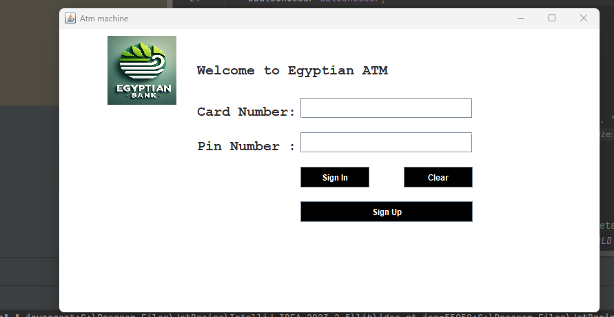
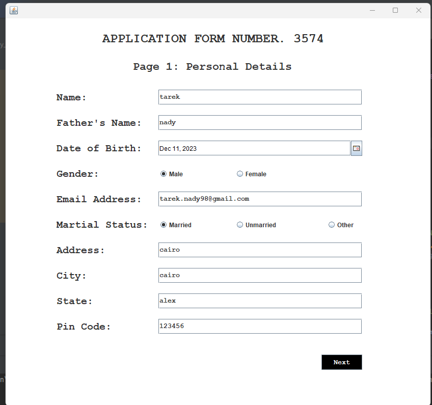
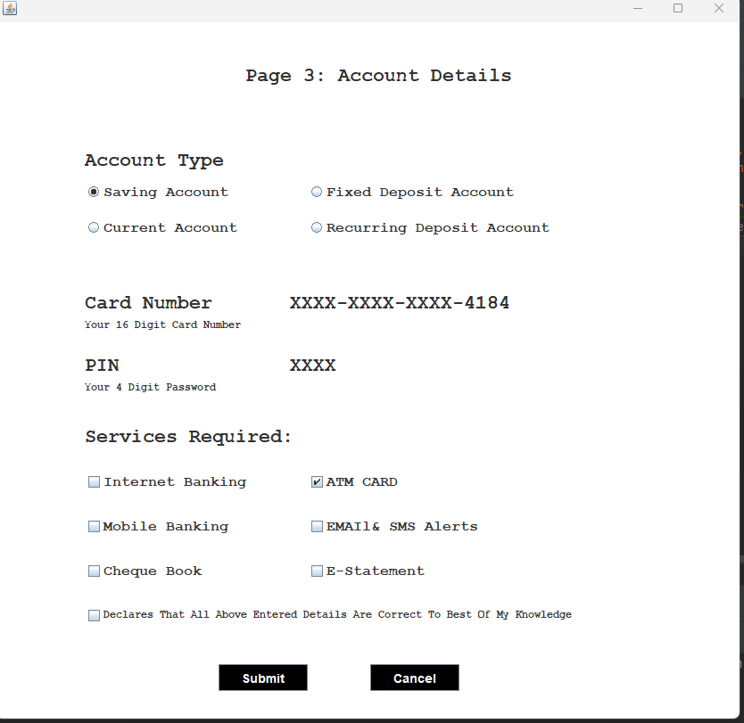
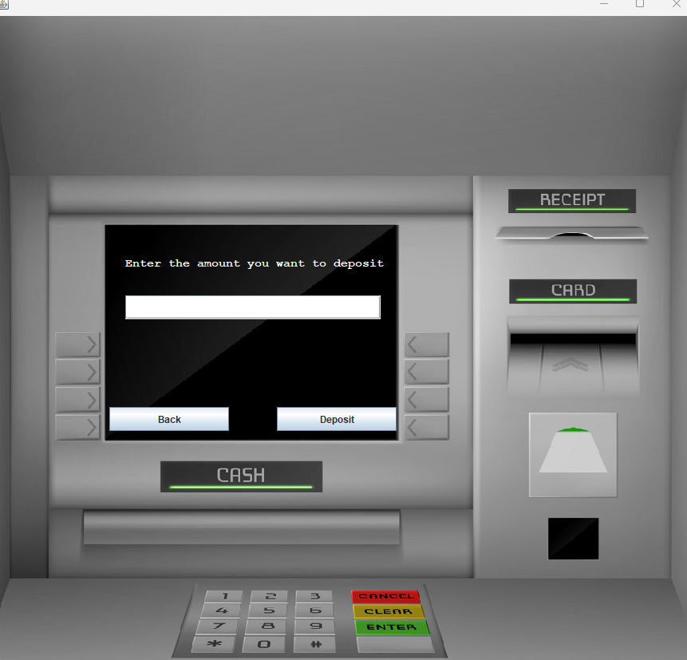
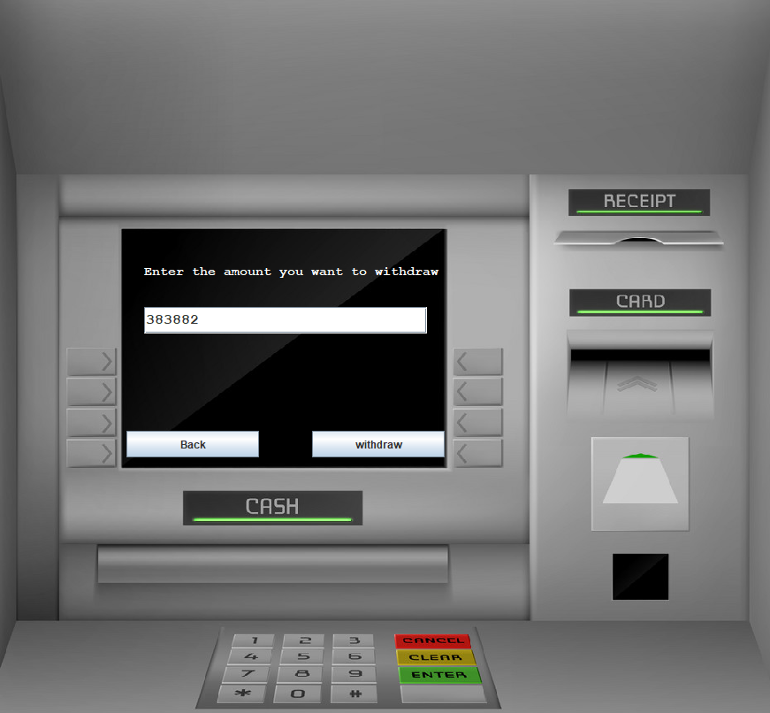

Hello this is desktop application using java and swing to handle many in bank process with migration to atm machine like deposit, withdraw, fast withdraw,change pin ,show your current balance in your account 
every time you open application it give you in signup process application from with random number

Images will show to you how app works:
 

