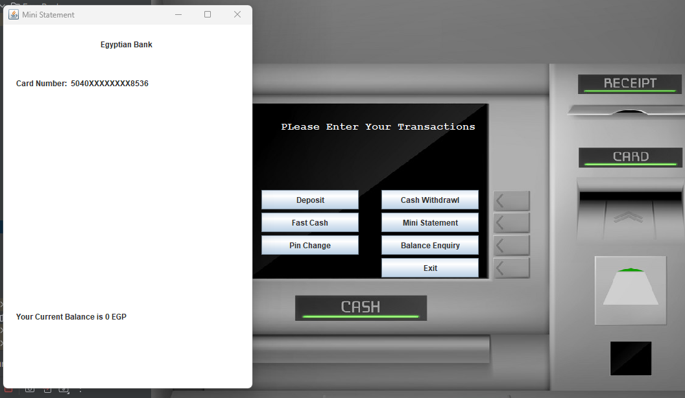
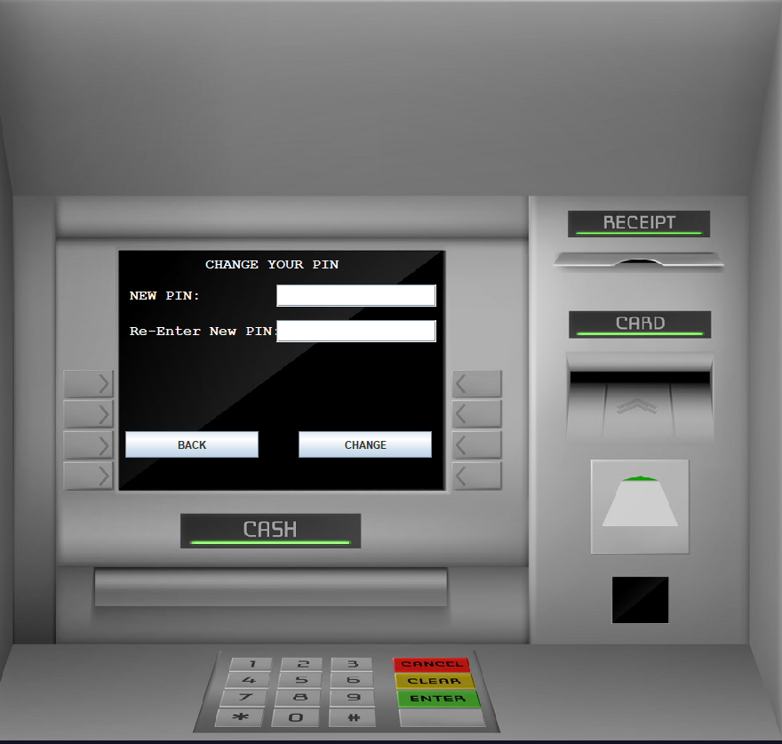
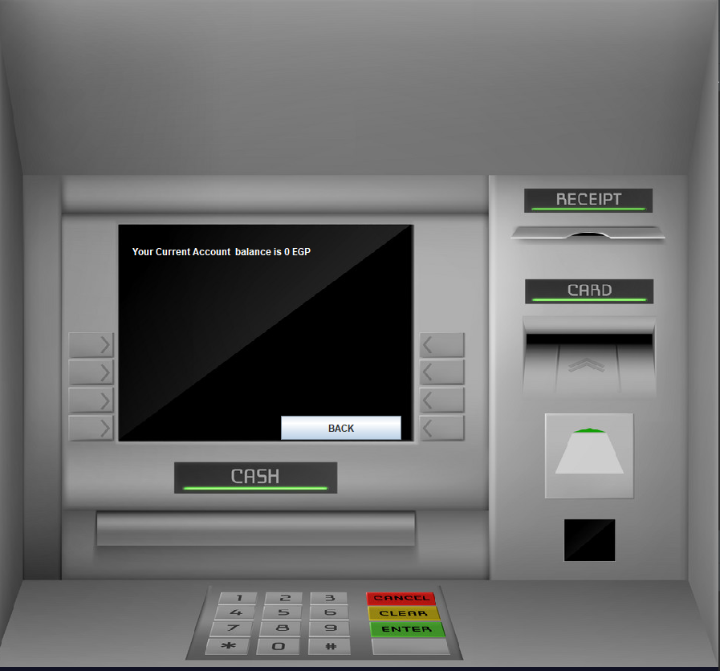
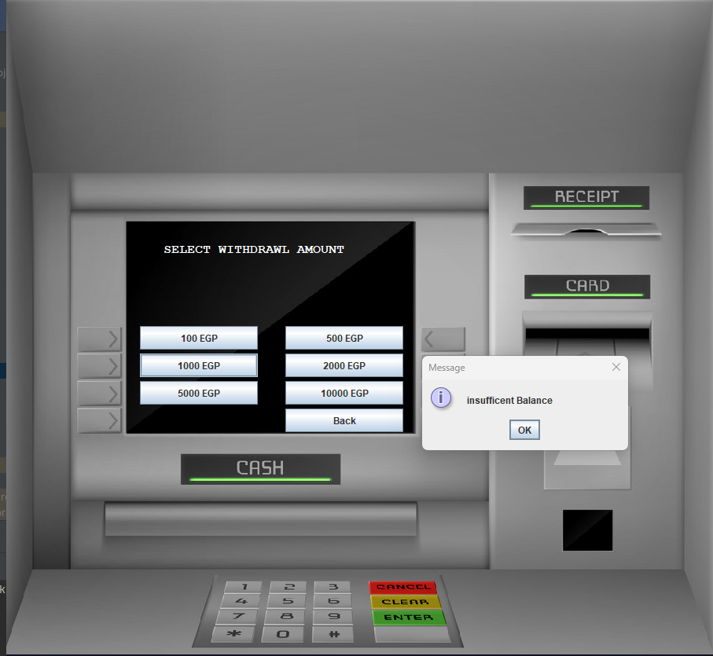
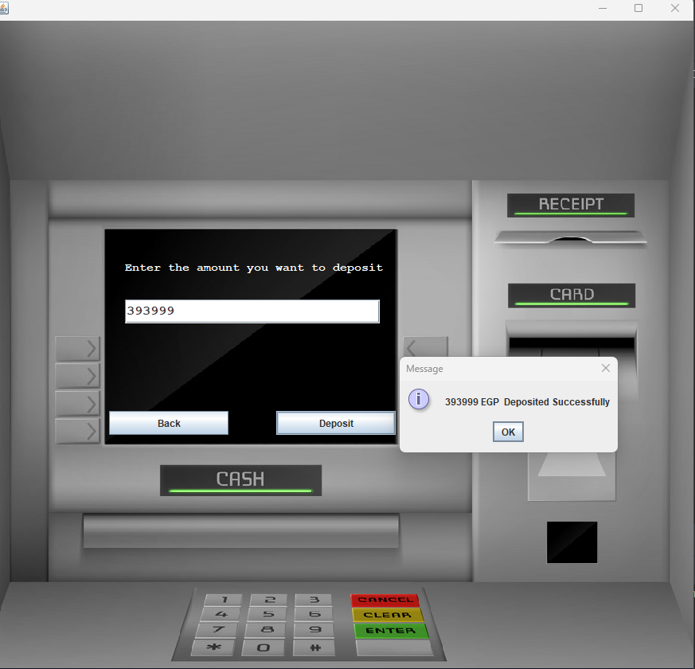

Hello this is desktop application using java and swing to handle many in bank process with migration to atm machine like deposit, withdraw, fast withdraw,change pin ,show your current balance in your account 
every time you open application it give you in signup process application from with random number

Images will show to you how app works:
 
<figure>
    
    <figcaption>this is login form which if you aleardy register you can login with your card number and pint scrret number</figcaption>
     
</figure>

<figure>
    
    <figcaption>report about your account</figcaption>
     
</figure>

<figure>
    
    <figcaption>this signup page to take your personal information in case if you press signup button</figcaption>
     
</figure>

<figure>
    
    <figcaption>this is account details page</figcaption>
     
</figure>

<figure>
    
    <figcaption>this deposit operation</figcaption>
     
</figure>

 
<figure>
    
    <figcaption>this withdraw operation</figcaption>
     
</figure>

<figure>
    
    <figcaption>you can change pin number </figcaption>
     
</figure>

 

<figure>
    
    <figcaption>show your current balance</figcaption>
     
</figure>

 

<figure>
    
    <figcaption>you can do fast cash</figcaption>
     
</figure>

 

<figure>
    
    <figcaption>verfiy your deposit operation</figcaption>
     
</figure>

